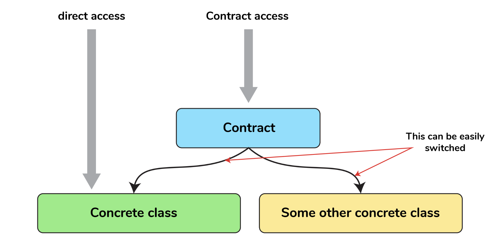

    

        Que. What are Relationships in Laravel?
    

    Ans. Relationships in Laravel are a way to define relations between different models in the applications. 
        It is the same as relations in relational databases.

        Different relationships available in Laravel are:
        One to One
        One to Many
        Many to Many
        Has One Through
        Has Many Through
        One to One (Polymorphic)
        One to Many (Polymorphic)
        Many to Many (Polymorphic)
        Relationships are defined as a method on the model class. An example of One to One relation is shown below. 
        <?php
            namespace App\Models;
            use Illuminate\Database\Eloquent\Model;
            class User extends Model
            {
                public function phone()
                {
                    return $this->hasOne(Phone::class);
                }
            }
        ?>
        The above method phone on the User model can be called like : `$user->phone` or `$user->phone()->where(...)->get()`

    

        Que. What is Eloquent in Laravel?
    

    Ans. Eloquent is the ORM(object relation mapper) used to interact with the database using Model classes. 
        It gives handy methods on class objects to make a query on the database.

        It can directly be used to retrieve data from any table and run any raw query. 
        But in conjunction with Models, we can make use of its various methods and also make use of relationships 
        and attributes defined on the model.

        Some examples of using the Eloquent are below:
        `DB::table(‘users’)->get()`
        `User::all()`
        `User::where(‘name’, ‘=’, ‘Eloquent’)->get()`

    

        Que. What is throttling and how to implement it in Laravel?
    

    Ans. Throttling is a process to rate-limit requests from a particular IP. 
        This can be used to prevent DDOS(Distributed Denial-of-Service) attacks as well. 
        For throttling, Laravel provides a middleware that can be applied to routes and it can be added 
        to the global middlewares list as well to execute that middleware for each request.

        Here’s how you can add it to a particular route:

        Route::middleware('auth:api', 'throttle:60,1')->group(function () {
            Route::get('/user', function () {
                //
            });
        });

        This will enable the /user route to be accessed by a particular user from a particular 
        IP only 60 times in a minute.

    

        Que. What are facades?
    

    Ans. Facades are a way to register your class and its methods in Laravel Container so they are available 
        in your whole application after getting resolved by Reflection.
        The main benefit of using facades is we don’t have to remember long class names and also 
        don’t need to require those classes in any other class for using them. It also gives more 
        testability to the application.

        # When to Utilize Facades
        Facades have many benefits. They provide a terse, memorable syntax that allows you to use Laravel's 
        features without remembering long class names that must be injected or configured manually. 
        Furthermore, because of their unique usage of PHP's dynamic methods, they are easy to test.

    

        Que. What are Events in Laravel?
    

    Ans. In Laravel, Events are a way to subscribe to different events that occur in the application. 
        We can make events to represent a particular event like user logged in, user logged out, user-created post, etc. 
        After which we can listen to these events by making Listener classes and do some tasks like, user logged in 
        then make an entry to audit logger of application.
        For creating a new Event in laravel, we can call below artisan command:
        `php artisan make:event UserLoggedIn`

        For this event to work, we need to create a listener as well. We can create a listener like this:
        `php artisan make:listener SetLogInFile --event=UserLoggedIn`

    

    

        Que. Explain logging in Laravel?
    

    Ans. Laravel Logging is a way to log information that is happening inside an application. 
        Laravel provides different channels for logging like file and slack. 
        Log messages can be written on to multiple channels at once as well.

        We can configure the channel to be used for logging in to our environment file or in the config 
        file at config/logging.php

    

        Que. What is Localization in Laravel?
    

    Ans. Localization is a way to serve content concerning the client's language preference. 
        We can create different localization files and use a laravel helper method like this: `__(‘auth.error’)` 
        to retrieve translation in the current locale. 
        These localization files are located in the resources/lang/[language] folder.

    

        Que. What are Requests in Laravel?
    

    Ans. Requests in Laravel are a way to interact with incoming HTTP requests along with sessions, cookies, 
        and even files if submitted with the request.

        The class responsible for doing this is Illuminate\Http\Request.

        When any request is submitted to a laravel route, it goes through to the controller method, 
        and with the help of dependency Injection, the request object is available within the method. 
        We can do all kinds of things with the request like validating or authorizing the request, etc.

    

        Que. How to do request validation in Laravel?
    

    Ans. Request validation in laravel can be done with the controller method or we can create a 
        request validation class that holds the rules of validation and the error messages associated with it.
        examples:
            
            /** 
            * Store a new blog post.
            *
            * @param  \Illuminate\Http\Request  $request
            * @return \Illuminate\Http\Response
            */
            public function store(Request $request)
            {
                $validated = $request->validate([
                    'title' => 'required|unique:posts|max:255',
                    'body' => 'required',
                ]);

                // The blog post is valid...
            }

    

        Que. What is a Service Container in Laravel?
    

    Ans. Service Container or IoC in laravel is responsible for managing class dependencies meaning 
        not every file needs to be injected in class manually but is done by the Service Container automatically. 
        Service Container is mainly used in injecting class in controllers like Request object is injected. 
        We can also inject a Model based on id in route binding.

        For example, a route like below:
        Route::get('/profile/{id}', 'UserController@profile');

        With the controller like below.
        public function profile(Request $request, User $id)
        {
            // 
        }

        In the UserController profile method, the reason we can get the User model as a parameter is because 
        of Service Container as the IoC resolves all the dependencies in all the controllers while booting the server.
        This process is also called route-model binding.

        or

        Service container is a powerful tool for managing class dependencies and performing dependency injection. 
        Its sole responsibility is to manage the dependencies in your laravel project.

    

    Que. What is dependency injection?
    

    Ans. Dependency Injection means that class dependencies are “injected” into the class via 
        the constructor or, in some cases, “setter” methods. Mostly constructor is used for 
        injecting the dependency.

        Service container is like a container where we define how the dependency should be resolved. 
        We have to register the dependencies into the service container during the initialization of the 
        framework and the best place to do it is the service provider.

    

        Que. What is a Service Provider?
    

    Ans. A Service Provider is a way to bootstrap or register services, events, etc before booting the application. 
        Laravel’s own bootstrapping happens using Service Providers as well. Additionally, registers service 
        container bindings, event listeners, middlewares, and even routes using its service providers.
        If we are creating our application, we can register our facades in provider classes.

    

        Que. What is the register and boot method in the Service Provider class?
    

    Ans. The register method in the Service Provider class is used to bind classes or services to the Service 
        Container.It should not be used to access any other functionality or classes from the application as the 
        service you are accessing may not have loaded yet into the container.

        The boot method runs after all the dependencies have been included in the container and now we can 
        access any functionality in the boot method. Like you can create routes, create a view composer, 
        etc in the boot method.

    

        Que. How to define routes in Laravel?
    

    Ans. Laravel Routes are defined in the routes file in routes/web.php for web application routes. 
        Routes can be defined using Illuminate\Support\Facades\Route and calling its static methods 
        such as to get, post, put, delete, etc.

        use Illuminate\Support\Facades\Route;
        Route::get('/home', function () {
            return 'Welcome to Home Sweet Home';
        });
        A typical closure route looks like the above, where we provide the URI and the closure function 
        to execute when that route is accessed.

        Route::get('/hello', 'HomeController@index');

        Another way is like above, we can directly give the controller name and the method to call, 
        this can again be resolved using Service Container.

    

        Que. What are named routes?
    

    Ans. A named route is a route definition with the name assigned to it. We can then use that name to 
        call the route anywhere else in the application.

        Route::get('/hello', 'HomeController@index')->name('index');
        This can be accessed in a controller using the following:

        return redirect()->route('index');

    

        Que. What are route groups?
    

    Ans. Route Groups in laravel is used when we need to group route attributes like middlewares, prefixes, etc. 
        we use route groups. It saves us a headache to put each attribute to each route.

        Syntax:

        Route::middleware(['throttleMiddleware'])->group(function () {
            Route::get('/', function () {
                // Uses throttleMiddleware
            });

            Route::get('/user/profile', function () {
                // Uses throttleMiddleware
            });
        });

    

        Que. What is Middleware and how to create one in Laravel?
    

    Ans. Middleware gives developers the ability to inspect and filter incoming HTTP requests of our application. 
        One such middleware that ships with laravel are the authentication middleware which checks if the user 
        is authenticated and if the user is authenticated it will go further in the application otherwise 
        it will throw the user back to the login screen.

        We can always create a new middleware for our purposes. For creating a new middleware we can use the
        below artisan command:

       `php artisan make:middleware CheckFileIsNotTooLarge`

        The above command will create a new middleware file in the app/Http/Middleware folder.

    

        Que. How to create a route for resources in laravel?
    

    Ans. For creating a resource route we can use the below command:

        Route::resource('blogs', BlogController::class);
        This will create routes for six actions index, create, store, show, edit, update and delete.

    

        Que. What are collections?
    

    Ans. Collections in laravel are a wrapper over an array of data in Laravel. All of the responses 
        from Eloquent ORM when we query data from the database are collections (Array of data records).

        Collections give us handy methods over them to easily work with the data like looping over 
        data or doing some operation on it.

    

        Que. What are contracts?
    

    Ans. Laravel Contracts are a set of interfaces with implementation methods to complete the core tasks of Laravel.
        
        Few examples of contracts in Laravel are Queue and Mailer. 
        Queue contract has an implementation of Queuing jobs while Mailer contract has an implementation to send emails.

    

        Que. What are queues in Laravel?
    

    Ans. While building any application we face a situation where some tasks take time to process and 
        our page gets loading until that task is finished. One task is sending an email when a user registers, 
        we can send the email to the user as a background task, so our main thread is responsive all the time. 
        Queues are a way to run such tasks in the background.

    

        Que. What are accessors and mutators?
    

    Ans. Accessors are a way to retrieve data from eloquent after doing some operation on the retrieved 
        fields from the database. For example, if we need to combine the first and last names of users 
        but we have two fields in the database, but we want whenever we fetch data from eloquent queries 
        these names need to be combined.

        We can do that by creating an accessor like below:
        public function getFullNameAttribute()	 	 
        {	 	 
            return $this->first_name . " " . $this->last_name;	 	 
        }

        What the above code will do is it will give another attribute(full_name) in the collection of the model, 
        so if we need the combined name we can call it like this: `$user->full_name`. 
        Mutators are a way to do some operations on a particular field before saving it to the database.

        For example, if we wanted the first name to be capitalized before saving it to the database, 
        we can create something like the below:

        public function setFirstNameAttribute($value)
        {
            $this->attributes[‘first_name’] = strtoupper($value);
        }
        So, whenever we are setting this field to be anything:

        $user->first_name = Input::get('first_name');
        $user->save();
        It will change the first_name to be capitalized and it will save to the database.

