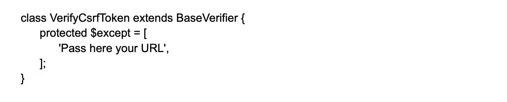
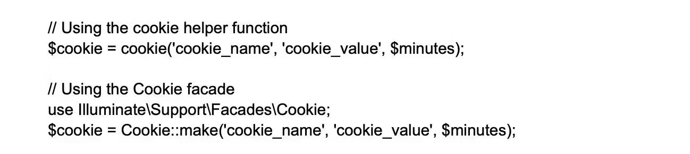
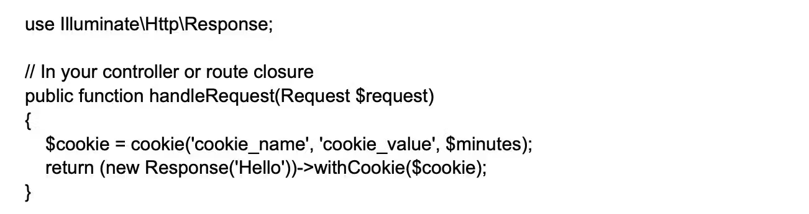
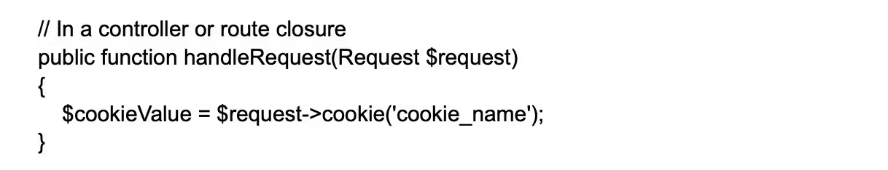
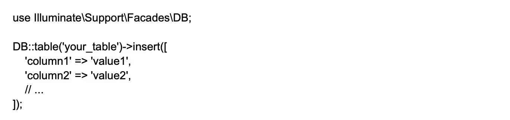
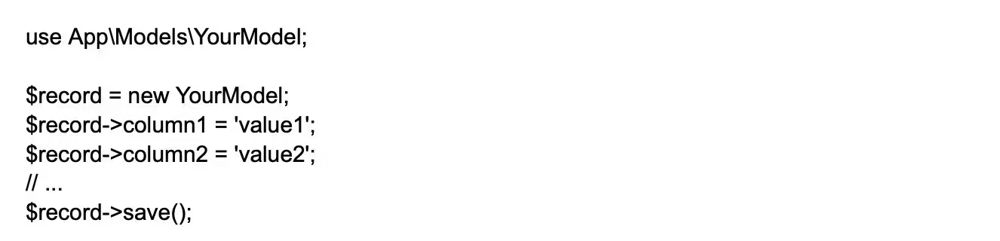

    

        Que. Explain the process of disabling CSRF protection on specific routes?
    

    Ans. In Laravel, the CSRF (Cross-Site Request Forgery) protection middleware is enabled by default.
        To disable CSRF protection for specific routes, developers can add the URL or route to the ‘$except’ variable. 
        The variable is readily available from the path app\Http\Middleware\VerifyCsrfToken.php file. 
        Check out the example below to get a better understanding of the same. 
        
        
        for all routes:

         protected $except = [
            '*'
        ];

    

        Que. Advantages of service Containers? 
    

    Ans.
       - Easy class dependency management for creating objects.
       - Services contained as a registry.
       - Allows binding of interfaces to concrete classes.

    

        Que. Mention the process of using cookies in Laravel?
    
 
    Ans. In Laravel, cookies can be used to store small amounts of data on the client-side and retrieve 
        them at a later time. Laravel supports handling and managing cookies via the Illuminate\Http\Request 
        and Illuminate\Http\Response objects. To work with cookies in Laravel, follow these steps: 
        Creating Cookies:  
        To create a cookie, use the cookie helper function or the Cookie facade. This generates a new 
        Illuminate\Cookie\CookieJar instance representing the cookie, with options such as name, value, 
        duration, path, domain, secure, and HTTP only. 
         
        Attaching Cookies to Responses:   
        To send the created cookie to the client, attach it to your response object using the withCookie method. 
         
        Retrieving Cookies:   
        To access the values of cookies sent by the client, use the cookie method on the Illuminate\Http\Request object. 
         
        Encryption:   
        By default, Laravel encrypts and signs all cookies, ensuring data confidentiality and integrity. 
        If you need to set a cookie that should not be encrypted, add the cookie's name to the except array 
        in the config/cookie.php configuration file.

    

        Que. How to use insert statement function in Laravel?
    

    Ans. Query Builder:  
        To insert data using Laravel's Query Builder, you can use the insert method on the DB facade:
         
        Eloquent ORM:  
        To insert a new record using Eloquent ORM, create a new model instance, set the desired attributes, 
        and call the save method: 
        

    

        Que. How to use the updateOrInsert() method in Laravel Query?
    

    Ans.

    

        Que.
    

    Ans.

    

        Que.
    

    Ans.

    

        Que.
    

    Ans.

    

        Que.
    

    Ans.

    

        Que.
    

    Ans.

    

        Que.
    

    Ans.

    

        Que.
    

    Ans.

    

        Que.
    

    Ans.

    

        Que.
    

    Ans.

    

        Que.
    

    Ans.

    

        Que.
    

    Ans.

    

        Que.
    

    Ans.

    

        Que.
    

    Ans.

    

        Que.
    

    Ans.

    

        Que.
    

    Ans.

    

        Que.
    

    Ans.

    

        Que.
    

    Ans.

    

        Que.
    

    Ans.

