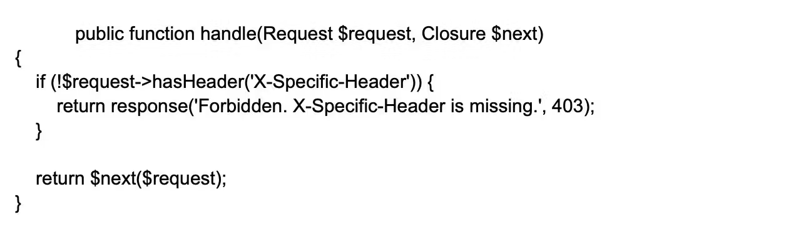
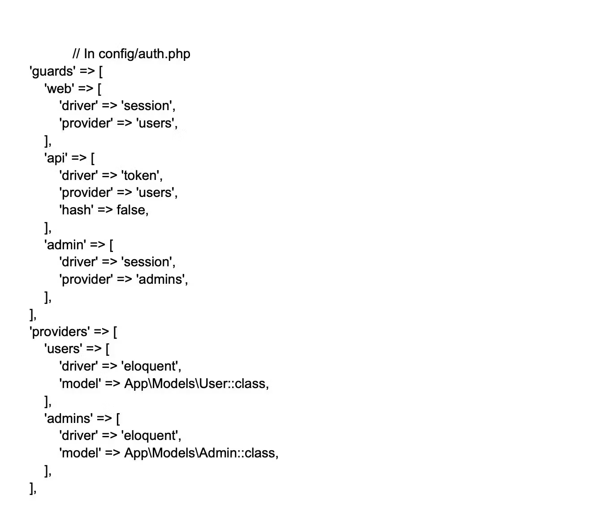
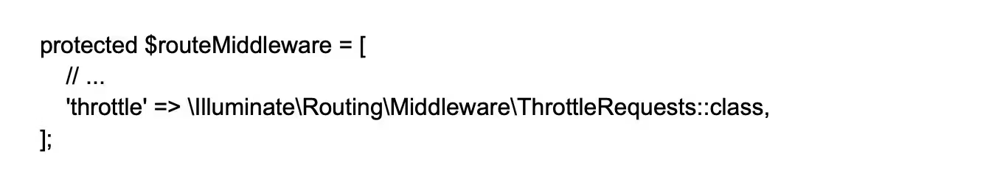
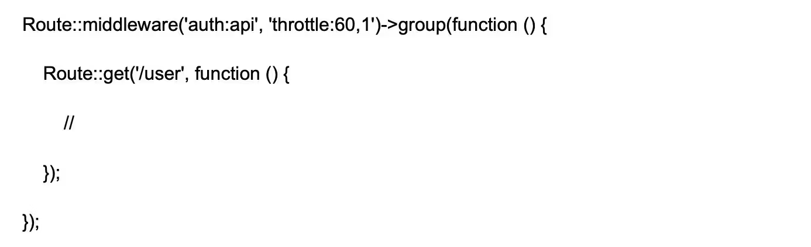

    

        Que. Explain the process of disabling CSRF protection on specific routes?
    

    Ans. In Laravel, the CSRF (Cross-Site Request Forgery) protection middleware is enabled by default.
        To disable CSRF protection for specific routes, developers can add the URL or route to the ‘$except’ variable. 
        The variable is readily available from the path app\Http\Middleware\VerifyCsrfToken.php file. 
        Check out the example below to get a better understanding of the same. 
        
        
        for all routes:

         protected $except = [
            '*'
        ];

    

        Que. Advantages of service Containers? 
    

    Ans.
       - Easy class dependency management for creating objects.
       - Services contained as a registry.
       - Allows binding of interfaces to concrete classes.

    

        Que. Mention the process of using cookies in Laravel?
    
 
    Ans. In Laravel, cookies can be used to store small amounts of data on the client-side and retrieve 
        them at a later time. Laravel supports handling and managing cookies via the Illuminate\Http\Request 
        and Illuminate\Http\Response objects. To work with cookies in Laravel, follow these steps: 
        Creating Cookies:  
        To create a cookie, use the cookie helper function or the Cookie facade. This generates a new 
        Illuminate\Cookie\CookieJar instance representing the cookie, with options such as name, value, 
        duration, path, domain, secure, and HTTP only. 
         
        Attaching Cookies to Responses:   
        To send the created cookie to the client, attach it to your response object using the withCookie method. 
         
        Retrieving Cookies:   
        To access the values of cookies sent by the client, use the cookie method on the Illuminate\Http\Request object. 
         
        Encryption:   
        By default, Laravel encrypts and signs all cookies, ensuring data confidentiality and integrity. 
        If you need to set a cookie that should not be encrypted, add the cookie's name to the except array 
        in the config/cookie.php configuration file.

    

        Que. How to use insert statement function in Laravel?
    

    Ans. Query Builder:  
        To insert data using Laravel's Query Builder, you can use the insert method on the DB facade:
         
        Eloquent ORM:  
        To insert a new record using Eloquent ORM, create a new model instance, set the desired attributes, 
        and call the save method: 
        

    

        Que. How to use the updateOrInsert() method in Laravel Query?
    

    Ans. DB::table(‘blogs’)->updateOrInsert([Conditions],[fields with value]);

    

        Que. How to check if a column exists or not in a table?
    

    Ans. 
        

    

        Que. Explain what are gates in Laravel?
    

    Ans. Laravel gates are an essential part of the application’s authorization process. 
        They serve as mechanisms to determine if a user has the necessary permissions to perform a specific action. 
        These gates are defined using the Gate facade in the AuthServiceProvider. They use callback functions 
        to express the authorization logic in a simple and concise manner. 
        Laravel development services use Gates throughout the website or application to check user authorization. 
        Each Gate is responsible for evaluating a single action, making it possible to evaluate multiple user abilities.
        This feature of Laravel gates enhances app security and control through precise access control based on 
        user roles and permissions. 
        How to use gate:  
        create a Gate:  
        php artisan make:gate YourGateName
         
        Define Authorization Logic:  

        <?php
            namespace App\Providers;
            use Illuminate\Support\Facades\Gate;
            class YourGateName
            {
                public function boot()
                {
                    $this->registerPolicies();
                    Gate::define('your-gate-name', function ($user, $parameter) {
                        // Logic to determine if the user can perform the action
                        return /* Your authorization logic here */;
                    });
                }
            }
        ?>
 
        Register the Gate: 

        use App\Providers\YourGateName;
        class AuthServiceProvider extends ServiceProvider
        {
            protected $policies = [
                // Your model policies here
            ];
            public function boot()
            {
                $this->registerPolicies();
                $this->registerGates();
            }
            public function registerGates()
            {
                Gate::class('your-gate-name', YourGateName::class);
            }
        }
 
        Use the Gate in Controller or Middleware:  

        public function someControllerMethod()
        {
            if (Gate::allows('your-gate-name', $parameter)) {
                // Logic to perform when the gate allows the action
            } else {
                // Logic for denied access
            }
        }
 
        Use the Gate in Blade Views:  

        @can('your-gate-name', $parameter)
            <!-- Content for authorized users -->
        @else
            <!-- Content for unauthorized users -->
        @endcan
 
        Pass Additional Parameters:

        Gate::allows('your-gate-name', [$parameter1, $parameter2]);

    

        Que. What are Laravel Policies?
    

    Ans. Laravel policies are classes that streamline authorization logic, dictating the handling of actions within 
        an application. These policies consolidate the logic within their classes, simplifying the management 
        and comprehension of authorization rules. 
        Through policies, web developers can specify which users have authorization to perform particular actions, 
        like updating a post or deleting a comment. These policies are then associated with specific models for 
        granting precise control over user permissions. 
        Moreover, Laravel policies offer a convenient means of authorizing actions in controllers. 
        That guarantees that only authorized users can carry out specific tasks. In summary, Laravel policies 
        play an essential role in maintaining the security and oversight of user actions within a Laravel application.
 
        Purpose:  
        You can use Policies to define and implement authorization rules for different resources on the website. 
        Web development experts can encapsulate the logic that determines if a user can perform a specific action 
        on a resource. 
        That helps promote code organization and reusability. Policies can handle tasks like determining if a 
        user can view, create, update, or delete a resource. It can also help enforce access control and manage 
        user permissions within applications. In essence, Laravel Policies can help define the authorization logic. 
        That will ensure efficient and effective resource management.

    

        Que. How to Create and Register Policies?
    

    Ans. Create a Policy:  

        php artisan make:policy YourPolicyName  
 
        Define Authorization Logic: 

        <?php
            namespace App\Policies;
            use App\Models\User;
            use App\Models\Post;
            class YourPolicyName
            {
                public function view(User $user, Post $post)
                {
                    // Logic to determine if the user can view the post
                    return $user->id === $post->user_id;
                }
                // Add other authorization methods as needed
            }
        ?>
 
        Register the Policy: 

        <?php
        namespace App\Providers;
        use App\Models\Post;
        use App\Policies\YourPolicyName;
        class AuthServiceProvider extends ServiceProvider
        {
            protected $policies = [
                Post::class => YourPolicyName::class,
                // Add other model-policy associations as needed
            ];
            public function boot()
            {
                $this->registerPolicies();
                // Additional policy registration code, if any
            }
        }
        ?>
     
        Apply the Policy in Controller: 

        public function show(Post $post)
        {
            $this->authorize('view', $post);
            // Logic to show the post
        }
 

    

        Que. What is forge in Laravel?
    

    Ans. Laravel Forge is a server management and deployment platform designed specifically to streamline 
        the deployment and hosting of Laravel applications. Forge simplifies the provisioning, management, 
        and monitoring of servers, enabling you to focus on your application's features and functionality 
        rather than server configuration and maintenance tasks.

        Forge provides an intuitive interface for deploying and managing Laravel applications on popular 
        Infrastructure as a Service (IaaS) providers like AWS, DigitalOcean, Linode, or custom VPS providers.

    

        Que. How can you use Laravel's container to bind an interface to a concrete implementation?
    

    Ans. In Laravel, you can bind an interface to a concrete implementation using the Service Container's bind method.
        This enables dependency injection and makes the application more extensible and testable. Here's an example: 
        

    

        Que. Explain how to create and dispatch jobs in Laravel with delayed execution?
    

    Ans. To create a job in Laravel, first, run `php artisan make:job ProcessTask`. 
        This command will generate a Job class in app/Jobs/. 
        Edit the handle method to include the job's logic. 
        To dispatch a job with delayed execution, use the dispatch function with the delay method. For example: 
        

    

        Que. How do you create a middleware in Laravel that checks for a specific HTTP header?
    

    Ans. To create a middleware in Laravel, first, run the command `php artisan make:middleware CheckHttpHeader`. 
        This will generate a middleware class in app/Http/Middleware. Edit the handle method with the HTTP 
        header check logic: 
         
        Then, register the middleware in the app/Http/Kernel.php file and use it in your routes.

    

        Que. Explain how to define two different authentication guard systems in Laravel?
    

    Ans. To define two different authentication guards, you should edit the config/auth.php configuration file.
        Add new guards and providers specific to the different authentication methods. For example: 
        

    

        Que. Explain how to implement rate limiting for certain routes in Laravel?
    

    Ans.To implement rate limiting in Laravel, edit the app/Http/Kernel.php file to add 
        ThrottleRequests middleware to the $routeMiddleware array: 
         
        Then, apply the throttle middleware to the desired routes in your route definition files, specifying the rate limit and the time interval: 
        

    

        Que. Explain the process of making a constant for global use.
    

    Ans. Developers can create constant.php pages directly in the config folder if not available already. 
        Enter a constant variable with a corresponding value and use the command

        Config::get('constants.VaribleName');

    

        Que. What is the process of extending login time in Auth?
    

    Ans. Extending the login expiration time on Laravel is pretty easy and can be done with the 
        config\session.php. Developers only need to update the lifetime value mentioned in the variable. 
        The value of the variable usually is set to 120 by default, which can be altered based on requirements.

    

        Que. Explain throttling and how to implement it in Laravel.
    

    Ans. In Laravel, throttling is a perfect approach for rate-limiting requests from specific 
        IPs and is also capable enough to prevent DDOS attacks. The framework also provides a middleware 
        that is compatible with not just routes but global middleware as well. Developers can configure throttling 
        following the steps. 
        You can implement throttling as below: 
        

    

        Que. What is Nova?
    

    Ans. Laravel Nova is an administration panel for Laravel applications, developed and maintained by the Laravel team. 
        Nova is a beautifully designed, highly customizable, and powerful admin dashboard that allows 
        you to manage your application's data and resources with minimal effort. 
        Nova is designed to work seamlessly with your existing Laravel application, using your existing 
        Eloquent models and relationships to generate a complete administration panel without writing 
        any additional code.
         
        Some key features of Laravel Nova include:
         
        Resource Management: 
         
        Nova automatically generates admin panels for managing Eloquent models and their relationships, 
        enabling you to create, read, update, and delete records directly from the panel.
         
        Actions:
          
        Perform custom actions on model resources through the admin panel, such as bulk updates, 
        exporting data, or running admin-specific tasks.
         
        Filters:
          
        Create custom filters to narrow down the display of model records in the admin panel based 
        on specific conditions or attributes.
         
        Metrics:
          
        Display various data metrics, such as value, trend, and partition charts, on the dashboard 
        to get insights into your application's data.
         
        Lenses:
         
        Use lenses to create custom data views for your resources, allowing you to display and query data 
        differently than in the default resource views.
         
        Customization: 
          
        Easily extend and customize the appearance and functionality of the admin panel,
        making it adaptable to your project's specific requirements.
         
        Authorization: 
         
        Integrates with Laravel's built-in policy system to secure your admin panel, providing fine-grained 
        access control for different user roles.

    

        Que.
    

    Ans.

    

        Que.
    

    Ans.

    

        Que.
    

    Ans.

    

        Que.
    

    Ans.

