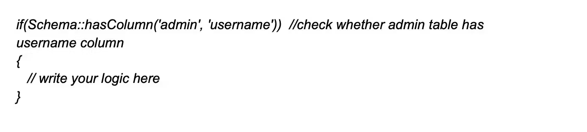

    

        Que. Explain the process of disabling CSRF protection on specific routes?
    

    Ans. In Laravel, the CSRF (Cross-Site Request Forgery) protection middleware is enabled by default.
        To disable CSRF protection for specific routes, developers can add the URL or route to the ‘$except’ variable. 
        The variable is readily available from the path app\Http\Middleware\VerifyCsrfToken.php file. 
        Check out the example below to get a better understanding of the same. 
        
        
        for all routes:

         protected $except = [
            '*'
        ];

    

        Que. Advantages of service Containers? 
    

    Ans.
       - Easy class dependency management for creating objects.
       - Services contained as a registry.
       - Allows binding of interfaces to concrete classes.

    

        Que. Mention the process of using cookies in Laravel?
    
 
    Ans. In Laravel, cookies can be used to store small amounts of data on the client-side and retrieve 
        them at a later time. Laravel supports handling and managing cookies via the Illuminate\Http\Request 
        and Illuminate\Http\Response objects. To work with cookies in Laravel, follow these steps: 
        Creating Cookies:  
        To create a cookie, use the cookie helper function or the Cookie facade. This generates a new 
        Illuminate\Cookie\CookieJar instance representing the cookie, with options such as name, value, 
        duration, path, domain, secure, and HTTP only. 
         
        Attaching Cookies to Responses:   
        To send the created cookie to the client, attach it to your response object using the withCookie method. 
         
        Retrieving Cookies:   
        To access the values of cookies sent by the client, use the cookie method on the Illuminate\Http\Request object. 
         
        Encryption:   
        By default, Laravel encrypts and signs all cookies, ensuring data confidentiality and integrity. 
        If you need to set a cookie that should not be encrypted, add the cookie's name to the except array 
        in the config/cookie.php configuration file.

    

        Que. How to use insert statement function in Laravel?
    

    Ans. Query Builder:  
        To insert data using Laravel's Query Builder, you can use the insert method on the DB facade:
         
        Eloquent ORM:  
        To insert a new record using Eloquent ORM, create a new model instance, set the desired attributes, 
        and call the save method: 
        

    

        Que. How to use the updateOrInsert() method in Laravel Query?
    

    Ans. DB::table(‘blogs’)->updateOrInsert([Conditions],[fields with value]);

    

        Que. How to check if a column exists or not in a table?
    

    Ans. 
        

    

        Que. Explain what are gates in Laravel?
    

    Ans. Laravel gates are an essential part of the application’s authorization process. 
        They serve as mechanisms to determine if a user has the necessary permissions to perform a specific action. 
        These gates are defined using the Gate facade in the AuthServiceProvider. They use callback functions 
        to express the authorization logic in a simple and concise manner. 
        Laravel development services use Gates throughout the website or application to check user authorization. 
        Each Gate is responsible for evaluating a single action, making it possible to evaluate multiple user abilities.
        This feature of Laravel gates enhances app security and control through precise access control based on 
        user roles and permissions. 
        How to use gate:  
        create a Gate:  
        php artisan make:gate YourGateName
         
        Define Authorization Logic:  

        <?php
            namespace App\Providers;
            use Illuminate\Support\Facades\Gate;
            class YourGateName
            {
                public function boot()
                {
                    $this->registerPolicies();
                    Gate::define('your-gate-name', function ($user, $parameter) {
                        // Logic to determine if the user can perform the action
                        return /* Your authorization logic here */;
                    });
                }
            }
        ?>
 
        Register the Gate: 

        use App\Providers\YourGateName;
        class AuthServiceProvider extends ServiceProvider
        {
            protected $policies = [
                // Your model policies here
            ];
            public function boot()
            {
                $this->registerPolicies();
                $this->registerGates();
            }
            public function registerGates()
            {
                Gate::class('your-gate-name', YourGateName::class);
            }
        }
 
        Use the Gate in Controller or Middleware:  

        public function someControllerMethod()
        {
            if (Gate::allows('your-gate-name', $parameter)) {
                // Logic to perform when the gate allows the action
            } else {
                // Logic for denied access
            }
        }
 
        Use the Gate in Blade Views:  

        @can('your-gate-name', $parameter)
            <!-- Content for authorized users -->
        @else
            <!-- Content for unauthorized users -->
        @endcan
 
        Pass Additional Parameters:

        Gate::allows('your-gate-name', [$parameter1, $parameter2]);

    

        Que. 
    

    Ans.

    

        Que.
    

    Ans.

    

        Que.
    

    Ans.

    

        Que.
    

    Ans.

    

        Que.
    

    Ans.

    

        Que.
    

    Ans.

    

        Que.
    

    Ans.

    

        Que.
    

    Ans.

    

        Que.
    

    Ans.

    

        Que.
    

    Ans.

    

        Que.
    

    Ans.

    

        Que.
    

    Ans.

    

        Que.
    

    Ans.

    

        Que.
    

    Ans.

    

        Que.
    

    Ans.

    

        Que.
    

    Ans.

